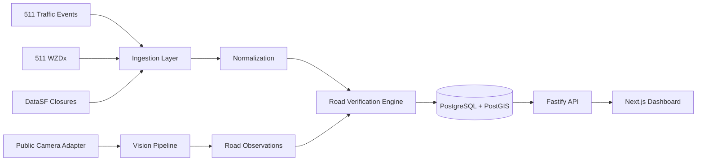

# Verytis

Verytis is a working MVP for a real-time road verification layer. It compares declared road state from public official feeds with observed road state from camera/vision and temporal signals, then surfaces possible information gaps when the physical road may no longer match the digital state.

The product hypothesis is: **the physical road may no longer match its declared digital state.**

This is not a navigation app, autonomous vehicle system, traffic camera network, surveillance platform, or retroactive claim about any historical incident. The MVP uses careful language such as "possible information gap detected" and "possible unreported road closure."

## Architecture



## Data Flow

1. Connectors fetch source data server-side and never expose private keys to the browser.
2. Raw source payloads are persisted in `raw_source_records` with source provenance and deterministic hashes.
3. Mappers normalize events into canonical road state records.
4. Live camera streams are sampled through SSRF-protected URL validation, hashed, analyzed, and converted into observations.
5. The deterministic road engine evaluates nearby declared events and observations using freshness-aware evidence scoring.
6. The Fastify API serves standardized road intelligence JSON to the dashboard.

## Data Sources

- `sf511_traffic_events`: official 511 SF Bay traffic events from `https://api.511.org/traffic/events`.
- `sf511_wzdx`: official 511 SF Bay WZDx work zone/closure feed from `https://api.511.org/traffic/wzdx`.
- `datasf_temporary_closures`: DataSF temporary street closures dataset `8x25-yybr`.
- `manual_camera`: public camera URLs manually registered in the database/API.
- `caltrans_camera`: official Caltrans CWWP2 public CCTV feed for District 4. San Francisco cameras are imported in live-only mode with HLS stream URLs; static `currentImageURL` snapshots are not stored for Caltrans.

DataSF absence is represented as **UNKNOWN**, never **OPEN**.

## Environment Setup

```bash
pnpm install
docker compose up -d postgres
pnpm db:migrate
pnpm db:seed
pnpm demo:seed
pnpm demo:run
pnpm api
pnpm web
```

Open the dashboard at `http://localhost:3000` and API docs at `http://localhost:4000/docs`.

If `pnpm` is not installed, enable it with Corepack from Node:

```bash
corepack enable
corepack prepare pnpm@9.15.4 --activate
```

## Environment Variables Explained

`NODE_ENV`: runtime mode. Optional. Server-side and browser build tooling may read it. Not secret.

`WEB_PORT`: intended dashboard port. Optional. The web script defaults to `3000`. Not secret.

`API_PORT`: Fastify API port. Optional, default `4000`. Server-side. Not secret.

`VISION_PORT`: Python vision service port. Optional, default `5000`. Server-side. Not secret.

`NEXT_PUBLIC_API_URL`: browser-visible API base URL. Required for deployed frontend, defaults to `http://localhost:4000`. Not secret.

`NEXT_PUBLIC_MAPBOX_ACCESS_TOKEN`: browser-visible Mapbox public token. Required to render Mapbox-hosted styles such as `mapbox://styles/mapbox/streets-v12`. Use a restricted public token for production.

`NEXT_PUBLIC_MAPBOX_STYLE_URL`: browser-visible Mapbox style URL. Optional, default `mapbox://styles/mapbox/streets-v12`. Not secret.

`NEXT_PUBLIC_MAP_STYLE_URL`: legacy browser-visible style URL alias. Optional. Prefer `NEXT_PUBLIC_MAPBOX_STYLE_URL` for new deployments.

`MAPBOX_ACCESS_TOKEN`: server-side Mapbox token used by the API for optional event geocoding. Keep it on the backend. If absent, events without source coordinates remain unpositioned.

`MAPBOX_GEOCODING_ENABLED`: enables server-side Mapbox geocoding for display enrichment. Optional, default `true` when a token exists.

`MAPBOX_GEOCODING_PERMANENT`: set to `true` only if your Mapbox account/plan allows permanent geocoding result storage. Default `false`.

`MAPBOX_GEOCODING_MAX_EVENTS_PER_RESPONSE`: maximum street-only events geocoded per API response. Optional, default `20`.

`LIVE_EVENT_DISPLAY_TTL_SECONDS`: controls how long a freshly seen event stays eligible for the live map. Default `300`. Expiry means "not fresh enough for the live map", not "the road reopened".

`DATABASE_URL`: PostgreSQL/PostGIS connection string. Required for real runtime. Server-side secret-ish infrastructure value; never expose in frontend code.

`DATABASE_POOL_MAX`: PostgreSQL connection pool size. Optional. Server-side. Not secret.

`SF511_API_KEY`: required for real 511 ingestion. Obtain from the 511 SF Bay Open Data Portal. Server-side secret. Never prefix with `NEXT_PUBLIC_`.

`SF511_EVENTS_POLL_SECONDS`: polling interval for 511 Traffic Events. Optional. Server-side. Not secret.

`SF511_WZDX_POLL_SECONDS`: polling interval for 511 WZDx. Optional. Server-side. Not secret.

`SOCRATA_APP_TOKEN`: optional DataSF/Socrata application token. Server-side secret. The connector works without it when the public endpoint allows anonymous access.

`DATASF_CLOSURES_POLL_SECONDS`: polling interval for DataSF closures. Optional. Server-side. Not secret.

`CAMERA_POLL_SECONDS`: camera polling interval. Optional. Server-side. Not secret.

`CAMERA_FETCH_TIMEOUT_MS`: camera/live-frame fetch timeout. Optional. Server-side. Not secret.

`ROAD_EVENT_MATCH_RADIUS_METERS`: spatial matching radius. Optional, default `100`. Server-side. Not secret.

`CAMERA_OBSERVATION_STALE_SECONDS`: stale threshold for camera evidence. Optional, default `120`. Server-side. Not secret.

`TRAFFIC_OBSERVATION_STALE_SECONDS`: stale threshold for traffic observations. Optional, default `300`. Server-side. Not secret.

`DISCREPANCY_MIN_SCORE`: minimum evidence score needed to persist a discrepancy. Optional, default `0.70`. Server-side. Not secret.

`VISION_PROVIDER`: `local`, `mock`, or `external`. Optional, default `local`. Use `external` to call OpenAI vision through the Responses API. Server-side. Not secret.

`VISION_API_KEY`: required only when `VISION_PROVIDER=external`. Use an OpenAI API key. Server-side secret. Never expose in frontend code.

`VISION_MODEL`: optional model name. For `external`, defaults to `gpt-5.6-luna` when empty. For `local`, leave empty unless you want the Python service to load a specific YOLO model. Server-side. Not secret by itself.

`VISION_SERVICE_URL`: base URL for the Python vision service when `VISION_PROVIDER=local`. Optional, default `http://localhost:5000`. Ignored by the OpenAI external analyzer. Server-side. Not secret.

`DEMO_MODE`: enables deterministic demo behavior. Optional, default `true`. Server-side. Not secret.

`LOG_LEVEL`: Pino logging level. Optional, default `info`. Server-side. Not secret.

## Getting a 511 API Token

Create an account/token through the 511 SF Bay Open Data Portal, then set:

```bash
SF511_API_KEY=your_token_here
```

The backend and worker call 511. The frontend never receives this key.

## DataSF Usage

The DataSF connector reads dataset metadata first, infers relevant field names, and queries a bounded set of current/upcoming rows from `https://data.sfgov.org/resource/8x25-yybr.json`. `SOCRATA_APP_TOKEN` is optional.

## Caltrans Public Cameras

Caltrans CWWP2 publishes a public District 4 CCTV JSON feed at `https://cwwp2.dot.ca.gov/data/d4/cctv/cctvStatusD04.json`. The app imports San Francisco records into the `cameras` table:

```bash
pnpm cameras:sync:caltrans
```

The feed includes `currentImageURL` static images and, for many cameras, `streamingVideoURL` HLS playlists. Verytis uses the HLS playlists only for Caltrans: static `currentImageURL` values are not stored in the local camera registry.

The dashboard camera detail page plays live HLS streams with `hls.js`. The worker uses `ffmpeg` to capture an ephemeral frame from the live HLS stream, analyzes it immediately, stores the derived observation, and sends the updated road state through the live SSE feed.

Caltrans fair use matters: do not bulk stream 10 or more video feeds simultaneously without a written agreement with Caltrans Traffic Operations. Verytis limits automated live capture concurrency to 4 streams and validates streams before marking them active.

Snapshot fetching blocks localhost, private IP ranges, link-local addresses, and cloud metadata hosts.

## Local Development

Required commands:

```bash
pnpm install
pnpm dev
pnpm db:migrate
pnpm db:seed
pnpm cameras:sync:caltrans
pnpm ingest:once
pnpm demo:seed
pnpm demo:run
pnpm test
```

Run the optional vision service:

```bash
docker compose --profile vision up -d vision-service
```

## Production Deployment

The frontend is Vercel-ready as a monorepo app. Create the Vercel project with Root Directory set to `apps/web`; Vercel will use `apps/web/vercel.json`.

Set only browser-safe frontend variables in Vercel:

```bash
NEXT_PUBLIC_API_URL=https://api.verytis.dev
NEXT_PUBLIC_MAPBOX_ACCESS_TOKEN=your_restricted_public_mapbox_token
NEXT_PUBLIC_MAPBOX_STYLE_URL=mapbox://styles/mapbox/streets-v12
```

Use `apps/web/.env.vercel.example` as the checklist. Do not put `VISION_API_KEY`, `DATABASE_URL`, `SF511_API_KEY`, `RESEND_API_KEY`, or webhook/API signing secrets in the Vercel frontend project.

Run the API, worker, database, and optional local vision service outside the Vercel frontend project. For production OpenAI vision, the backend/worker environment should use:

```bash
NODE_ENV=production
VISION_PROVIDER=external
VISION_API_KEY=your_openai_api_key
VISION_MODEL=gpt-5.6-luna
```

`DATABASE_URL` must point to the production PostgreSQL/PostGIS instance used by the API and worker. Do not keep `localhost` unless that process really runs on the same host as the database.

In this mode, the worker samples live camera streams, sends the sampled frame to OpenAI through the Responses API, normalizes the returned JSON into observations, and the API exposes the resulting live state to the dashboard and vehicle-facing endpoints.

## Running Real Ingestion

```bash
docker compose up -d postgres
pnpm db:migrate
pnpm db:seed
SF511_API_KEY=... pnpm ingest:once
```

Failures in one connector are recorded in `ingestion_runs` and source health; they do not crash the whole ingestion cycle.

## Running Demo Mode

```bash
pnpm demo:seed
pnpm demo:run
```

The deterministic Halleck Street scenario inserts demo-labeled observations showing normal activity, decreasing activity, possible obstruction, persistent interruption, and possible blockage. The normal production rule engine generates `possible_unreported_closure`; the frontend does not hardcode the confidence score.

## API Endpoints

- `GET /health`
- `GET /metrics`
- `GET /api/v1/connectors`
- `GET /api/v1/connectors/:source/health`
- `GET /api/v1/live`
- `GET /api/v1/live/state`
- `GET /api/v1/live/snapshot`
- `POST /api/v1/ingestion/run`
- `GET /api/v1/events`
- `GET /api/v1/events/:id`
- `GET /api/v1/discrepancies`
- `GET /api/v1/discrepancies/:id`
- `GET /api/v1/cameras`
- `GET /api/v1/cameras/:id`
- `POST /api/v1/cameras`
- `POST /api/v1/cameras/:id/analyze`
- `GET /api/v1/observations`
- `GET /api/v1/road-segments/:id/state`
- `GET /api/v1/demo/scenario`

Supported filters include `bbox`, `latitude`, `longitude`, `radius`, `source`, `event_type`, `severity`, `confidence_min`, `status`, `since`, `until`, and `limit`.

Errors use:

```json
{
  "error": {
    "code": "CONNECTOR_UNAVAILABLE",
    "message": "511 WZDx connector is unavailable",
    "details": {},
    "request_id": "..."
  }
}
```

## Confidence Model

V0 confidence is a normalized explainable evidence score, not a scientific probability. Evidence factors include fresh official explicit closure, explicit declared open state, visual barrier detection, repeated visual blockage, persistent flow interruption, single visual model interpretation, stale source records, and explicit source conflicts. Freshness multipliers reduce stale evidence.

## What The MVP Does Not Claim

Verytis does not claim to prevent incidents, solve autonomous driving, prove a road is open from missing records, or infer traffic speed from a single image. Flow claims require multiple temporally separated observations.

## Future Connectors

The architecture leaves room for ArcGIS Feature Services, other WZDx feeds, GTFS service alerts, city camera feeds, public traffic feeds, connected vehicle data, commercial traffic APIs, and OpenStreetMap road segment imports.
